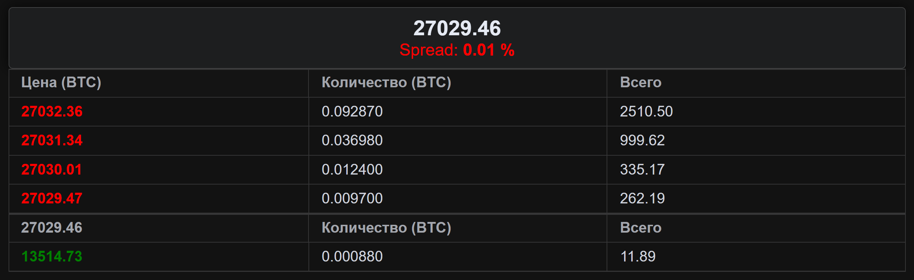

# [Задание](./doc/README.md)

## Выполнены задачи:

1. Создан компонент `"Биржевой стакан"` на `Vue.js`, отображающий цены и количества для каждого ордера.

1. Вычисляется и отображается спред, представляющий разницу между лучшей ценой на покупку и продажу.

1. Реализована подписка на стрим биржевого стакана с использованием `API` метода `GET` `/orderbook-stream`.

1. Получение наших ордеров осуществляется через API метод `GET` `/orders`.

1. Обеспечена корректная обработка обновлений данных, получаемых из стрима.

1. Предусмотрена обработка ошибок и исключительных ситуаций при взаимодействии с `API`.

Тестовая версия доступна по ссылке:
[](https://order-btc-vue3.vercel.app/)

## `Не` выполнены задачи:

1.  Вместо явного перечисления методов в `computed`, следовало использовать `mapGetters` для более лаконичной записи.

2.  При отсутствии параметра в методе, рекомендуется его определение как computed, чтобы улучшить читаемость и понимание кода.

3.  Реализовано визуальное выделение наших ордеров внутри компонента.

## Структура файлов:

```bash
public
├── favicon.ico
├── index.html
├── assets
│   └── logo.png
└── fonts
    └── UniSansHeavy.otf
src
├── App.vue
├── main.js
├── components
│   ├── LoadingSpinner.vue
│   ├── OrderBook.vue
│   ├── OrderTable.vue
│   └── SpreadInfo.vue
└── store
    ├── api.js
    └── store.js
```

1. `OrderBook.vue`: Это главный компонент, отвечающий за отображение списка ордеров и расчет разницы в ценах (спреда). Он содержит заголовки, две таблицы с ордерами (продажа и покупка) и компонент `Spread` для отображения спреда. Он также обрабатывает данные, полученные через `WebSocket` и `API` запросы.
2. `OrderTable.vue`: Это компонент, отвечающий за отображение таблицы с ордерами. Он принимает массив ордеров через свойство `orders` и отображает их в виде строк таблицы. Компонент также проверяет, является ли ордер пользовательским и применяет соответствующий стиль. Он также имеет методы для форматирования цены, количества и общей стоимости ордера.
3. `SpreadInfo.vue`: Это компонент, отвечающий за отображение разницы в ценах (спреда). Он принимает значение спреда через свойство `spread` и отображает его на странице. Компонент также имеет метод для форматирования значения спреда.
4. `LoadingIndicator.vue`: является компонентом, отвечающим за отображение индикатора загрузки. Он использует фреймворк `UI Element Plus` для создания интерфейса.
